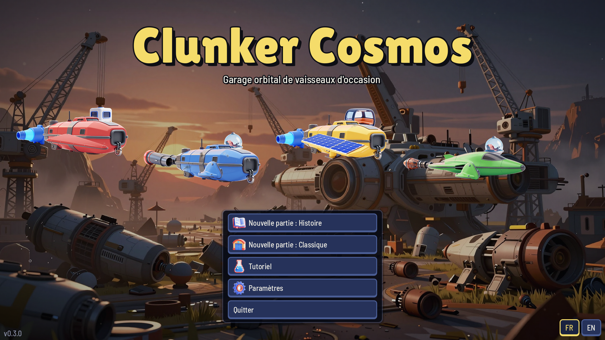
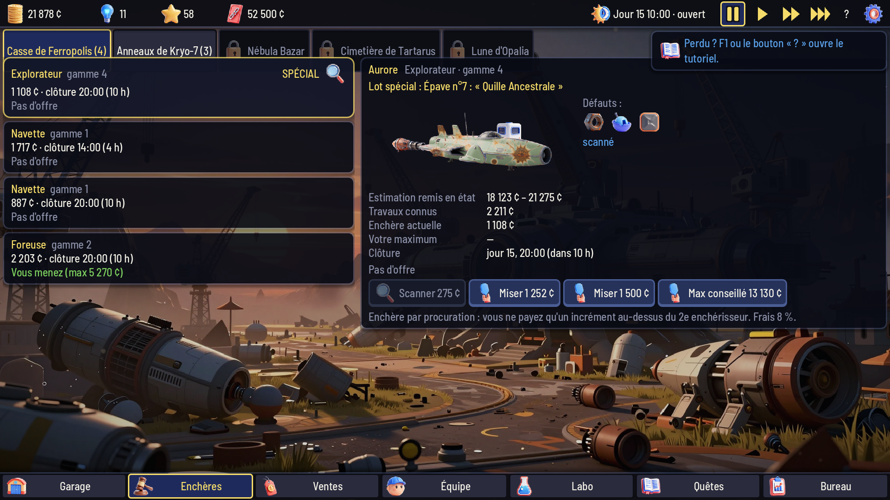
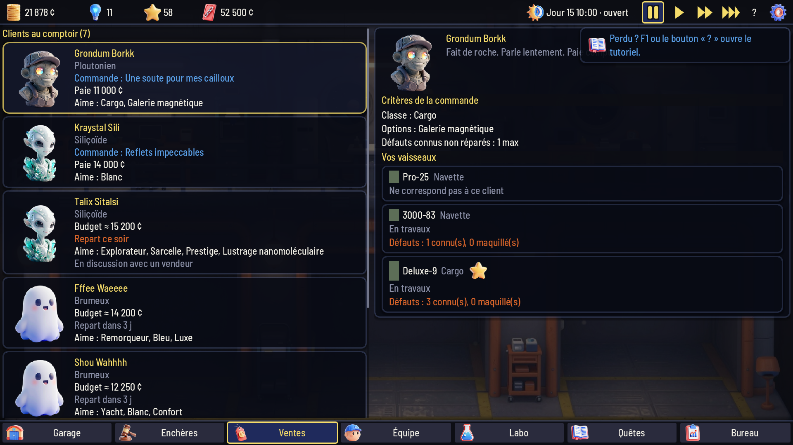
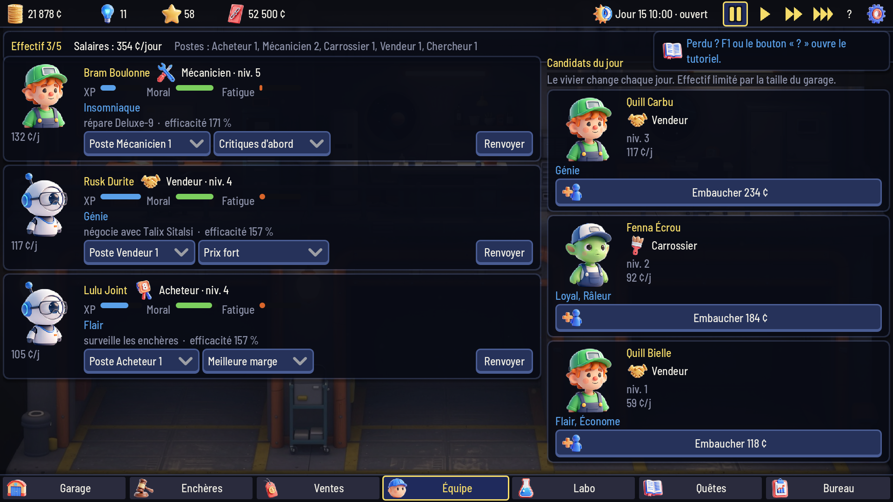
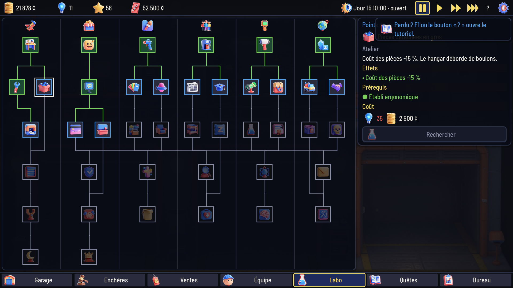
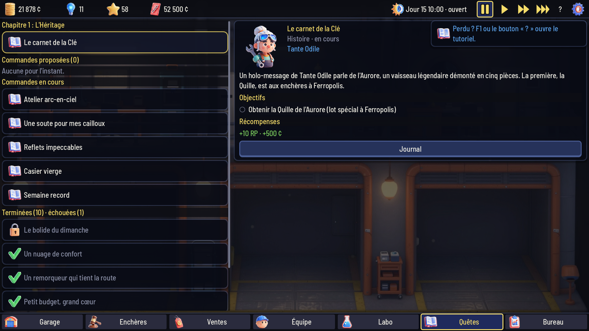
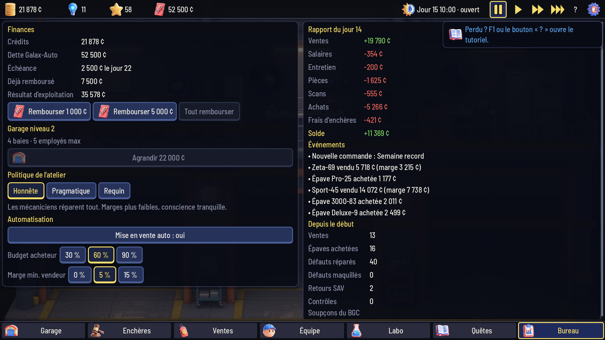
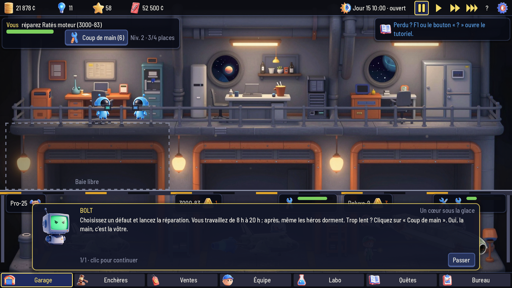

# Clunker Cosmos

Jeu de **gestion en 2.5D** pour PC (Steam) : vous tenez un garage orbital de vaisseaux d'occasion,
vu en coupe. Achetez des épaves aux enchères, réparez-les (ou maquillez leurs défauts…), personnalisez-les,
revendez-les à des clients aliens, embauchez une équipe que l'on voit travailler dans l'atelier. Ce n'est pas
un idle : rien n'avance quand le jeu est fermé. Mode **Histoire** (5 chapitres, 2 fins) ou **Classique**.
Français / English, musique et bruitages, tutoriel intégré.


## Aperçu

| | |
|---|---|
|  |  |
| **Écran titre** — Histoire ou Classique, FR/EN | **Enchères** — 5 lieux, scan des épaves, mises par procuration |
|  |  |
| **Ventes** — clients aliens, critères, contre-offres | **Équipe** — postes, règles de priorité, embauche |
|  |  |
| **Labo** — arbre de 42 technologies | **Quêtes** — 5 chapitres, 2 fins, quêtes secondaires |
|  |  |
| **Bureau** — finances, dette, agrandissement | **Dialogues** — BOLT, l'ordinateur de bord sarcastique |

Bande-annonce : [FR](docs/steam/trailer_fr.mp4) · [EN](docs/steam/trailer_en.mp4).

Version 0.3 : rendu **2.5D** (personnages, vaisseaux et décors en 3D stylisée pré-calculée, ombres, parallaxe,
interface lisse) à la place du pixel art des versions précédentes.

## Lancer le jeu

1. Installer **Godot 4.7.1 stable** (ou laisser `tools/godot.py` le télécharger dans `tools/godot/`).
2. Ouvrir le projet (`project.godot`) dans Godot et lancer la scène principale (F5), ou :
   ```
   Godot_v4.7.1-stable_win64_console.exe --path .
   ```

Commandes : clic gauche partout ; **Espace** pause ; **1-3** vitesse ; **Échap** paramètres ; **F1** tutoriel ;
**F11** plein écran ; **F12** capture. La **taille de l'interface** se règle dans les paramètres (automatique :
853×480 en 1440p, 640×360 en 1080p ; jusqu'à 1280×720 en 1440p pour une interface plus fine).

### Exécutable Windows

```
python tools/export_windows.py     # → <Bureau>/Clunker Cosmos/ : Clunker Cosmos.exe + .pck + .ico
```
Préréglage « Windows Desktop » d'`export_presets.cfg` (exe 64 bits avec l'icône du jeu, `.pck` à côté) ; il faut
les modèles d'export de Godot 4.7.1 (éditeur → *Gérer les modèles d'export*). L'outil lance ensuite le test de
fumée du jeu exporté. Pour jouer ou partager : copier tout le dossier (l'exe a besoin du `.pck` à côté de lui).

## Vérifications

```
python tools/check_all.py          # import, tests headless, simulation 30 jours, chapitres 1-2,
                                    # test de fumée de l'UI, assets, manifeste, audio, workflows, docs,
                                    # captures, kit Steam
python tools/screenshots.py        # captures du vrai jeu dans docs/screens/ (1920×1080)
tools/run_tests.sh --suite=unit    # tests unitaires seuls
```

`check_all.py` n'utilise que la bibliothèque standard de Python (≥ 3.10).

## Structure

| Dossier | Contenu |
|---|---|
| `scripts/core/` | logique pure (enchères, atelier, ventes/SAV/contrôles, RH, recherche, quêtes, sauvegarde, réglages, placement des employés, autopilote) |
| `scripts/autoload/` | `Content` (données), `I18n` (FR/EN), `Game` (partie, temps réel, pauses automatiques, sauvegarde), `Audio` (musique, bruitages) |
| `scripts/ui/` | interface construite en code (thème lisse, polices Barlow et Lilita One, taille d'interface variable), écrans, visite automatique |
| `data/` | tout le contenu en JSON (pièces, défauts, espèces, personnel, lieux, arbre, histoire, quêtes, tutoriel, textes UI) |
| `assets/` | images finales en HD (4× leur taille en jeu), masques de peinture, musiques et bruitages, polices |
| `art/` | manifestes de traçabilité (images, audio), composition du garage, comparatifs de modèles |
| `comfy/` | workflows ComfyUI (format API), liste des modèles, instantané `/object_info` |
| `tools/` | pipeline d'art et d'audio (`hd_art.py`, `gen_assets.py`, `gen_audio.py`, `sfx_synth.py`), vérifications, captures, kit Steam, export Windows |
| `tests/` | lanceur headless, suites unitaires, simulation, contrôle des assets |
| `docs/` | GDD, décisions, avancement, licences, divulgation IA, captures, kit Steam |

## Art, audio et IA

Les visuels sont générés **localement** avec ComfyUI et le modèle open-weights **Z-Image-Turbo (Apache-2.0)**,
dans un style de rendu 3D stylisé, puis détourés et réduits par `tools/hd_art.py`. Les musiques sont générées
localement avec **ACE-Step 1.5 (MIT)** ; les bruitages sont synthétisés par code. Chaque fichier est tracé
(invite, graine, workflow, empreinte) dans `art/manifest.json` et `art/audio_manifest.json`. Aucune imitation
d'artiste, de studio ou de personnage existant. Détails : [docs/AI_DISCLOSURE.md](docs/AI_DISCLOSURE.md),
[docs/MODEL_LICENSES.md](docs/MODEL_LICENSES.md).

Régénérer l'art et l'audio (ComfyUI sur `127.0.0.1:8188`) :
```
.venv/Scripts/python.exe tools/gen_assets.py generate   # images brutes (art/raw_hd/, non versionné)
.venv/Scripts/python.exe tools/gen_assets.py sheets     # planches de revue
.venv/Scripts/python.exe tools/gen_assets.py build      # assets/ + manifeste + divulgation
.venv/Scripts/python.exe tools/gen_audio.py all         # musiques (ComfyUI) et bruitages (synthèse)
```

## Kit Steam

Bande-annonce FR/EN avec le son du jeu, captures 1920×1080, capsules et fiche magasin (textes FR/EN,
configuration requise, langues, tags, divulgation IA, reste à faire) :
**[docs/STEAM_STORE.md](docs/STEAM_STORE.md)**, fichiers dans `docs/steam/`. Tout est rendu par le jeu lui-même :
```
.venv/Scripts/python.exe tools/make_trailer.py      # vidéos (Movie Maker de Godot + ffmpeg du venv)
python tools/screenshots.py --steam                 # captures FR + EN
.venv/Scripts/python.exe tools/steam_assets.py      # capsules et icônes
```

## Documentation

- [docs/GDD.md](docs/GDD.md) — game design
- [docs/DECISIONS.md](docs/DECISIONS.md) — choix faits en autonomie
- [docs/PROGRESS.md](docs/PROGRESS.md) — avancement
- [docs/STEAM_STORE.md](docs/STEAM_STORE.md) — fiche et kit Steam
- [CLAUDE.md](CLAUDE.md) — mémo technique pour l'assistant de code

Hors périmètre de cette version : multijoueur.
