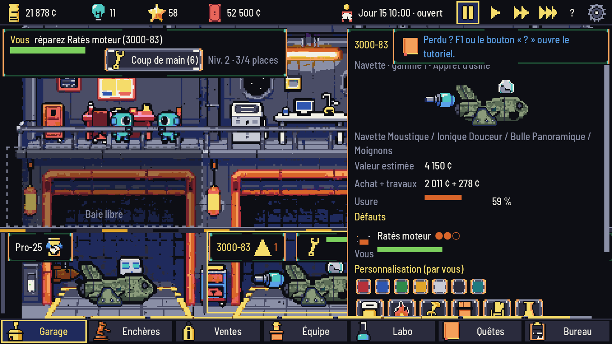

# Clunker Cosmos

Jeu **idle / gestion 2D en pixel art** pour PC (Steam) : vous tenez un garage orbital de vaisseaux d'occasion,
vu en coupe. Achetez des épaves aux enchères, réparez-les (ou maquillez leurs défauts…), personnalisez-les,
revendez-les à des clients aliens, embauchez une équipe qui automatise l'atelier — et qui continue de tourner
hors ligne. Mode **Histoire** (5 chapitres, 2 fins) ou **Classique**. Français / English.



## Lancer le jeu

1. Installer **Godot 4.7.1 stable** (ou laisser `tools/godot.py` le télécharger dans `tools/godot/`).
2. Ouvrir le projet (`project.godot`) dans Godot et lancer la scène principale (F5), ou :
   ```
   Godot_v4.7.1-stable_win64_console.exe --path .
   ```

Commandes : clic gauche partout ; **Espace** pause ; **1-3** vitesse ; **Échap** menu ; **F11** plein écran ;
**F12** capture.

## Vérifications

```
python tools/check_all.py          # import, 122 tests headless, simulation 30 jours, chapitres 1-2,
                                    # test de fumée de l'UI, assets, manifeste, workflows, docs, captures,
                                    # kit Steam
python tools/screenshots.py        # captures du vrai jeu dans docs/screens/
tools/run_tests.sh --suite=unit    # tests unitaires seuls
```

`check_all.py` n'utilise que la bibliothèque standard de Python (≥ 3.10).

## Structure

| Dossier | Contenu |
|---|---|
| `scripts/core/` | logique pure (enchères, atelier, ventes/SAV/contrôles, RH, recherche, quêtes, sauvegarde, hors-ligne, autopilote) |
| `scripts/autoload/` | `Content` (données), `I18n` (FR/EN), `Game` (partie, temps réel, sauvegarde) |
| `scripts/ui/` | interface construite en code (thème 9-slice, police Tiny5), écrans, visite automatique |
| `data/` | tout le contenu en JSON (pièces, défauts, espèces, personnel, lieux, arbre, histoire, quêtes, textes UI) |
| `assets/` | sprites finaux (générés, post-traités, palette de 32 couleurs) |
| `art/` | palette, manifeste de traçabilité, comparatifs de modèles |
| `comfy/` | workflows ComfyUI (format API), liste des modèles, instantané `/object_info` |
| `tools/` | pipeline d'art (`pixelize.py`, `gen_assets.py`), vérifications, captures |
| `tests/` | lanceur headless, suites unitaires, simulation, contrôle des assets |
| `docs/` | GDD, décisions, avancement, licences, divulgation IA, captures |

## Art et IA

Les visuels sont générés **localement** avec ComfyUI et le modèle open-weights **Z-Image-Turbo (Apache-2.0)**,
puis réduits et quantifiés sur une palette de 32 couleurs par `tools/pixelize.py`. Chaque fichier est tracé
(prompt, graine, workflow, empreinte) dans `art/manifest.json`. Aucune imitation d'artiste, de studio ou de
personnage existant. Détails : [docs/AI_DISCLOSURE.md](docs/AI_DISCLOSURE.md),
[docs/MODEL_LICENSES.md](docs/MODEL_LICENSES.md).

Régénérer l'art (ComfyUI sur `127.0.0.1:8188`) :
```
.venv/Scripts/python.exe tools/gen_assets.py generate   # images brutes (art/raw/, non versionné)
.venv/Scripts/python.exe tools/gen_assets.py sheets     # planches de revue
.venv/Scripts/python.exe tools/gen_assets.py build      # assets/ + manifeste + divulgation
```

## Kit Steam

Bande-annonce FR/EN, captures 1920×1080, capsules et fiche magasin (textes FR/EN, configuration requise,
langues, tags, divulgation IA, reste à faire) : **[docs/STEAM_STORE.md](docs/STEAM_STORE.md)**, fichiers dans
`docs/steam/`. Tout est rendu par le jeu lui-même :
```
.venv/Scripts/python.exe tools/make_trailer.py      # vidéos (Movie Maker de Godot + ffmpeg du venv)
python tools/screenshots.py --steam                 # captures FR + EN
.venv/Scripts/python.exe tools/steam_assets.py      # capsules et icônes
```

## Documentation

- [docs/GDD.md](docs/GDD.md) — game design
- [docs/DECISIONS.md](docs/DECISIONS.md) — choix faits en autonomie
- [docs/PROGRESS.md](docs/PROGRESS.md) — avancement
- [docs/STEAM_STORE.md](docs/STEAM_STORE.md) — fiche et kit Steam
- [CLAUDE.md](CLAUDE.md) — mémo technique pour l'assistant de code

Hors périmètre de cette version : audio, multijoueur.
